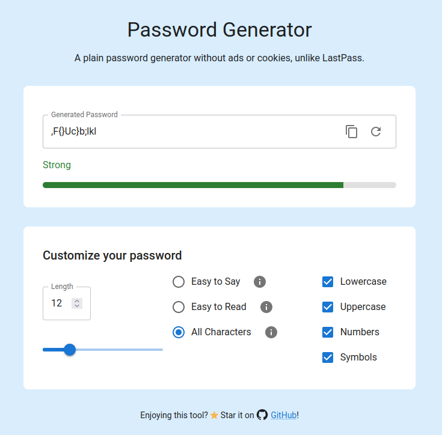

# Password Generator

A simple, secure, and customizable password generator built with Next.js and Material UI. Generate strong passwords without ads or cookies, unlike other tools such as LastPass.



## Getting Started

Follow these instructions to get a copy of the project up and running on your local machine for development and testing purposes.

### Installation

1. Clone the repository:

   ```bash
   git clone https://github.com/liketurbo/password-generator.git
   cd password-generator
   ```

2. Install dependencies:

   ```bash
   pnpm install
   ```

### Running the App

Start the development server:

```bash
npm run dev
```
